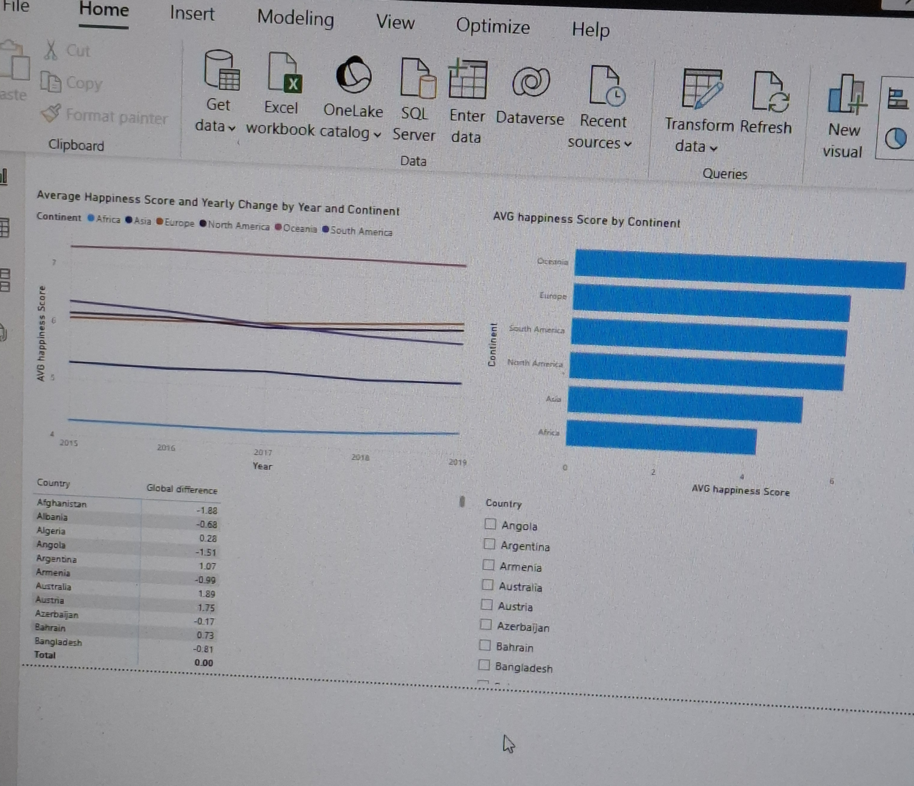

# Population-and-Happiness-Ranking
# Global Happiness Analysis (2015-2019) End-to-End Project

##  Project Overview
This comprehensive analysis project evaluates the World Happiness Report data from 2015 to 2019. The aim is to clean model, and visualize global happiness trends, identifying progress and areas needing improvement relative to the global average.

**Core Tools:** Python (Pandas), Power BI Desktop (Power Query, DAX).

---

## 1. Data Acquisition and Preparation (Python/Pandas)

This phase focused on data integrity, standardization, and consolidation from five separate annual files into a single, clean source for Power BI.

### Key Python/Pandas Steps:

* **Merging Datasets:** Five annual CSV files were concatenated into a single DataFrame using `pd.concat()`. A `Year` column was added for time-series context.
* **Cleaning & Standardization:** Addressed column name inconsistencies (e.g., standardizing 'Country or Region' to 'Country') and managed missing values.
* **Data Enrichment:** Mapped and appended consistent `Continent` and `Region` columns to the final DataFrame, laying the groundwork for geographical dimensions.

### Output:
The final clean dataset (`World_Happiness_Clean.csv`) was exported, ready for the Power BI environment.

---

## 2. Data Modeling and Transformation (Power BI)

This section details the creation of a high-performance, filter-efficient analytical model using Power BI's capabilities.

### 2.1. Power Query Transformations

The input CSV was processed in Power Query and restructured into a **Star Schema** architecture:

* **Fact Table:** `Fact_Happiness` (Contains `Happiness Score`, `Rank`, and other measures).
* **Dimension Tables:** `Dim_Country` (Unique `Country`, `Continent`), and `Dim_Year` (Unique `Year`).

### 2.2. Star Schema Implementation

Relationships were established in the Model View:


* **Cardinality:** One-to-Many (1:\*) from Dimension tables to the Fact table.
* **Filter Direction:** Single direction, ensuring dimensions correctly apply filters to the Fact table.

---

## 3. Advanced Analysis and Metrics (DAX)

Custom DAX measures were developed to enable dynamic, high-level comparative analysis within the dashboard.

...
### A. Time-Series Analysis (YOY Change)

Calculates the score change compared to the same period in the previous year:

```dax
YOY Happiness Change = 
[Avg Happiness Score] - 
CALCULATE(
    [Avg Happiness Score],
    SAMEPERIODLASTYEAR('Dim_Year'[Year])
)
```

### B. Global Benchmarking (Delta vs Global Avg)
Determines how far the current selection deviates from the non-filterable global average score:

```dax
Delta vs Global Avg = 
[Avg Happiness Score] - 
CALCULATE(
    [Avg Happiness Score],
    ALL('Dim_Country') 
)
```
## 4. Key Visualizations
1. Line Chart: Shows annual trends by Continent.
2. Bar Chart: Visualizes the current ranking of Continents by average happiness score
3. Matrix: Using YOY, countries can be compared to global average
4. Slicer: It makes visualization dynamic, country can be selected based on preference

   )
   
